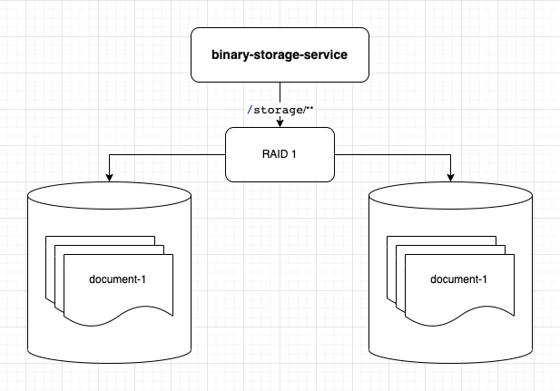

__binary-storage-service__ - simple internal storage service without authorization & authentication to store binary assets.


# Main consepts
- virtual bucket - it is directory in which client can store files. Can be implemented as different directories or storages.
- asset - storage entry. Usualy it is a file with extention, ex: `assetId = "myself.jpg"`

# Requirements
- Should be easier to use
- Should be able to support more them 10M files in one virtual bucket
- There is no subdirectories in the bucket. It is just single id `assetId = "subpath/myself.jpg"`

### deployment schema
by default, there is no redundancy or any types of failure resistance

Planed deployment schema



# Development

Run configurations for IntelliJ Idea are here: `./runConfigurations`

# Service API

## Docs

Swagger: http://localhost:8080/swagger-ui.html

## Monitoring

health check : http://localhost:8080/actuator/health

build info : http://localhost:8080/actuator/info

_also, Spring Boot Actuator can be configured with additional reports_

## Requests
```bash
curl -X 'GET' \
  'http://localhost:8080/api/v1/storage/list' \
  -H 'accept: application/json'
```
response
```json
connection: keep-alive
content-type: application/json
date: Thu,11 Aug 2022 19:11:50 GMT
keep-alive: timeout=60
transfer-encoding: Identity

[
  "backups",
  "my-first-bucket",
  "my-second-bucket",
  "photos"
]
```

# Docker

Build artifact

```bash
docker build --build-arg APPLICATION_VERSION="v1.0.0" -t binary-storage-service:v1.0.0 .
```

Run artifact

```bash
mkdiir /tmp/storage

docker run -i -t --rm --name binary-storage-service -p 8080:8080 \
 --memory=1G --cpus=1 \
 -v /tmp/storage:/storage \
 binary-storage-service:v1.0.0
 
# Adjust system requirements
docker run -i -t --rm --name binary-storage-service -p 8080:8080 \
 --memory=2G --cpus=1 \
 -e JAVA_OPTS="-Xms2G -Xmx2G -server" \
 -v /tmp/storage:/storage \
 binary-storage-service:v1.0.0
```
